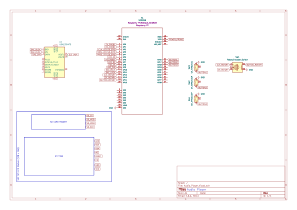

# Audio Player with Raspberry Pi Pico 2W

Audio player for headphones or devices with 3.5 jack.

:::info

**Author**: Rusu Carla-Maria \
**GitHub Project Link**: [link_to_github](https://github.com/UPB-PMRust-Students/proiect-rusucarla)

:::

## Description

This project implements a compact WAV audio player using the Raspberry Pi Pico 2W microcontroller.
The audio files are stored on a microSD card, read via SPI, and played through an I2S DAC (UDA1334A) connected to a 3.5mm headphone jack.
The user can use the push buttons and the rotary encoder to customize the experience.

---

## Motivation

The motivation for choosing this project was to explore embedded audio playback using Rust and Embassy on the Raspberry Pi Pico 2W.
The goal was to build a music player while learning low-level embedded I/O, SPI, I2S, and async execution using Rust.

---

## Architecture

### Components Overview

| Component           | Responsibility                                                 |
|-------------------- |----------------------------------------------------------------|
| Audio Handler       | Reads WAV files and streams audio via I2S to the DAC           |
| SPI Handler         | Interfaces with the SD card to access audio files and with the LCD to display information                                                                            |
| UI                  | Displays UI (e.g., file list, song name, progress)             |
| Input Handler       | Processes rotary encoder and buttons                           |
| Playback Controller | Controls playback state (play/pause, skip, etc.)               |

### Interconnection

- Input Handler dictates the state of the Playback Controller
- Playback Controller coordinates with Audio Manager and SPI Handler to stream audio.
- Audio Handler uses SPI Handler to get WAV file data.
- Playback Controller notifies UI to update the screen.

### Diagram

```mermaid
graph TD
    InputHandler[Input Handler - Buttons & Encoder]
    PlaybackController[Playback Controller]
    AudioHandler[Audio Manager]
    SPIHandler[SPI Handler - SD & LCD Access]
    UI[UI]

    InputHandler --> PlaybackController
    PlaybackController --> AudioHandler
    AudioHandler --> SPIHandler
    PlaybackController --> UI
```

---

## Log

### Week 5 - 11 May

### Week 12 - 18 May

### Week 19 - 25 May

---

## Hardware Design

### Hardware Description

The following hardware was used:

- Raspberry Pi Pico 2W
- UDA1334A I2S DAC with 3.5mm jack socket
- LCD with built-in SD slot (will see if this is the best option)
- 10k potentiometer/Rotary Encoder (not sure which I will use)
- 3 push buttons
- Breadboards and jumper wires

### Schematic

Tried to do something in Kicad (not for dark mode)

### Bill of Materials

| Item                                      | Quantity | Unit Price (RON) | Total (RON) | Usage                                    |
|-------------------------------------------|----------|------------------|-------------|------------------------------------------|
| Raspberry Pi Pico 2W                      | 1        | 39.66            | 39.66       | Main controller                          |
| Raspberry Pi Pico (debug / Picoprobe)     | 1        | 39.66            | 39.66       | Used for SWD debugging                   |
| UDA1334A I2S DAC Module                   | 1        | 56.76            | 56.76       | Audio output module                      |
| LCD SPI Display 1.8" (128x160) with SD slot | 1      | 28.99            | 28.99       | Used for UI and microSD (via SPI)        |
| Push Button (white round cap)             | 3        | 1.99             | 5.97        | Controls            |
| Rotary Encoder Module                     | 1        | 4.99             | 4.99        | Controls           |
| 10k Stereo Potentiometer                  | 1        | 1.99             | 1.99        | Analog Control (ADC input)       |
| Breadboard HQ (830 points)                | 2        | 9.98             | 19.96       | For main Pico + Picoprobe wiring         |
| Header pins (2.54 mm, 40p)                | 2        | 0.99             | 1.98        | For soldering Pico and accessories       |
| Female Breakable Header (40p)             | 1        | 2.56             | 2.56        | Extra connectivity (LCD/SD)              |
| Breadboard rigid wires                    | 1        | 12.49            | 12.49       | Neat wiring on breadboard                |
| Breadboard jumper wires                   | 1        | 7.99             | 7.99        | General-purpose jumpers                  |

Total Estimated Cost: 229.60 RON (for now)

---

## Software

To-do : complete later when I've finished

### Dependencies Overview

| Library | Description | Usage |
|--------|-------------|-------|
| [embassy](https://github.com/embassy-rs/embassy) | Async embedded framework | Core runtime for async tasks and peripherals |
| [embassy-rp](https://github.com/embassy-rs/embassy) | HAL for Raspberry Pi Pico (RP2040) | Controls GPIOs, SPI, I2S, etc. |
| [embedded-graphics](https://github.com/embedded-graphics/embedded-graphics) | 2D graphics library | Used for drawing text and shapes on LCD |
| [mipidsi](https://github.com/almindor/mipidsi) | Generic MIPI DSI display driver | Driver for ILI9341 LCD |
| [display-interface-spi](https://github.com/almindor/display-interface) | SPI display abstraction | Connects the embedded-graphics to SPI-based displays |
| [embedded-sdmmc](https://github.com/rust-embedded-community/embedded-sdmmc-rs) | FAT filesystem over SD card | Used to read `.wav` files from SD card |
| [embedded-hal](https://github.com/rust-embedded/embedded-hal) | Traits for embedded devices | Base for SPI, I2S, ADC, GPIO, etc. |
| [defmt](https://github.com/knurling-rs/defmt) | Logging crate for embedded | For debugging and structured logs |
| [micromath](https://github.com/NeoBirth/micromath) | Lightweight math functions | Used for calculations (e.g. UI animation, signal analysis) |

---

## Links
